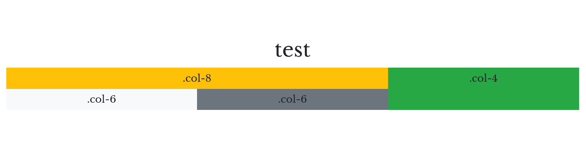

# Presentation maker

## Table of contents

- [Introduction](#introduction)
  * [Which method I should use](#which-method-i-should-use)
- [Getting Started](#getting-started)
  * [Prerequisites](#prerequisites)
  * [Installing](#installing)
    + [Virtual environment](#virtual-environment)
    + [Python 3.7 and venv issues](#python3.7-and-venv-issues)
    + [Edit course.yml](#edit-courseyml)
    + [Ready to make presentations](#ready-to-make-presentations)
- [Presentation settings](#presentation-settings)
  * [Create presentation_config.yaml](#create-presentation-configyaml)
  * [Setting priorities](#setting-priorities)
  * [Configuration file settings](#configuration-file-settings)
  * [Course parameters](#course-parameters)
    + [Changing title, subtitle, author and other things](#changing-title--subtitle--author-and-other-things)
    + [Selecting course rounds for presentation](#selecting-course-rounds-for-presentation)
    + [All parameters](#all-parameters)
- [Making presentations](#making-presentations)
  * [HTML presentation](#html-presentation)
  * [Selecting language for the presentation](#selecting-language-for-the-presentation)
    + [Parameters](#parameters)
    + [Configuration file](#configuration-file)
  * [PDF creation](#pdf-creation)
    + [With parameters](#with-parameters)
    + [With configuration file](#with-configuration-file)
  * [Selecting language for the presentation](#selecting-language-for-the-presentation)
    + [Parameters](#parameters)
    + [Configuration file](#configuration-file)
- [Workflow](#workflow)
    + [HTML presentation](#html-presentation-1)
    + [PDF and HTML presentations](#pdf-and-html-presentations)
- [Features](#features)
  * [Remove surrounding box from POI](#remove-surrounding-box-from-poi)
  * [Hide slides](#hide-slides)
  * [Math in the titles](#math-in-the-titles)
  * [Background images](#background-images)
  * [Columns and rows](#columns-and-rows)
  * [Videos in slides](#videos-in-slides)
    + [Youtube](#youtube)
        * [Example](#example)
    + [Local video file](#local-video-file)
        * [Example](#example-1)
  * [Audio file](#audio-file)
  * [JSVEE/JSAV animations](#jsvee-jsav-animations)
- [Tips for creating stuff](#tips-for-creating-stuff)
  * [Easier (and faster) way to create tables](#easier--and-faster--way-to-create-tables)
    + [List table directive](#list-table-directive)
    + [CSV table directive](#csv-table-directive)
- [Extras](#extras)
  * [Build a container](#build-a-container)
- [Troubleshooting](#troubleshooting)
  * [presentation_config.yaml not found](#presentation-configyaml-not-found)
- [Built With](#built-with)
- [Authors](#authors)

# Introduction

Presentation maker is a tool for making HTML & PDF presentations from multiple of reStructuredText (RST) files that contains directives called point-of-interests (POI). Each POI has at least title and some content in it. It may have images, figures and almost any other type of content which is valid RST. 

Presentation maker gathers content from all the POI in the RST files and makes a single RST file (presentation RST) from contents. This presentation RST file is compatible with hovercraft, which will be used to create HTML presentation. Presentation RST file contains slide transitions, fields and things that are required for hovercraft to work.

Since Hovercraft creates only HTML presentations, other solutions for PDF creation were needed.
1. First method is with rst2pdf.
2. Second method is deck2pdf which uses presentation RST file directly and also uses impress.js (same as hovercraft, so it is more compatible with this method) 
 
## Which method I should use
Each method has its downsides. But deck2pdf is recommended since it is more compatible.

- **deck2pdf** generates nice pdf files but converts pages to images. Texts cannot be copied and links no longer work.

- **Rst2pdf** Keeps text as a text, links working, but columns and background images do not work and does not look as 
nice as deck2pdf generated pdf files. Best to use with simple slides only.
 
# Getting Started

These instructions are for linux. 

## Prerequisites
- Python 3.5 or above
- Python 3 venv (`apt-get install python3-venv`)
- Git
- Docker
- [Roman (version 0.2.1rc4)](https://github.com/apluslms/roman)
- You will need [A+ LMS](https://apluslms.github.io/guides/quick/) and A+ course. From this link you will find instructions on how
to create a demo course.
- Remember to add `point_of_interest` (Sphinx extension module) in `conf.py` file.
  
```
# In conf.py - you may have different extensions than below. Just add point_of_interest.

extensions = [
'sphinx.ext.todo',
'sphinx.ext.mathjax',
'sphinx.ext.ifconfig',
'aplus_setup',
'point_of_interest',
'media'
]
```
- You will need POI in your A+ course material since the presentation will be made from them.

```

.. point-of-interest:: Title here

  This is a sample slide.

  Here is some other text. 

This text is no longer part of POI.

```

## About a-plus-rst-tools

Presentation maker does not depend on the a-plus-rst-tools. However, point-of-interests are written inside the normal A+ chapter RST files that are compiled into the A+ course materials (electronic textbook). Point-of-interests serve two purposes since they can be used inside the course materials and additionally, they can be compiled into a separate presentation with Presentation maker.

Using Presentation maker does not require the a-plus-rst-tools submodule in the course repository, but compiling the course materials does. New features have been added to point-of-interests due to the needs of presentations and thus, compiling the course materials requires a new version of a-plus-rst-tools if the latest features of point-of-interests are used. The latest updates to a-plus-rst-tools are still under development. The official version will be released in the summer 2020.

## Installing

### Virtual environment
 
If you haven't installed Roman yet. It is best to install it in the virtual environment. If you have it already installed then you can skip this step.

Create virtual environment, activate it. Update pip, setuptools and install Roman. Roman requires Python 3.5 or newer.
```
# in terminal
python3.7 -m venv venv
source venv/bin/activate

pip install -U pip 
pip install -U setuptools
pip install apluslms-roman==0.2.1rc4
```

#### Python3.7 and venv issues

I had to do this in order to get python3.7 to work in venv:

**Find out path to the Python3.7**

`which python3.7`

Copy resulting path to the command below. My path was `/usr/bin/python3.7`

**Install virtualenv**

`pip3 install virtualenv`

**Create virtual environment**

 `python3 -m virtualenv -p /usr/bin/python3.7 venv`
 
**Activate virtual environment**

`source venv/bin/activate`

Now in virtual environment type `python -V`, you should see python 3.7.5

### Edit course.yml
- Navigate to the root of your course directory
- Open course.yml file
- find line which starts with `img:` and replace the value with `apluslms/compile-presentation:latest` like in the example below. The `latest` tag can be replaced with a released version. Different versions of the container are listed in [hub.docker.com - compile-presentation](https://hub.docker.com/r/apluslms/compile-presentation). If you use the `latest` tag, then you should update your local copy of the container by running `docker pull apluslms/compile-presentation:latest`.
- It is also recommended to add path to the configuration file if it isn't there already. Default path to the configuration file is in the _build directory inside the course directory.

```
# after the changes course.yml looks something like this
---
version: 2

steps:
  - img: apluslms/compile-presentation:latest
    cmd: -y "presentation_config.yaml"
    mnt: /compile
    
```

## Ready to make presentations

### Run Roman

If you have some POI ready in your course material, then you are ready to create an presentation.

In terminal change directory to the root of your course directory. 

Try running Roman in your terminal. Make sure you have activated virtual environment, if you have it activated you should see `(venv)` at the beginning of the line.

```
roman
```
This is initial run so presentation may not look right. You can see the presentation by opening `index.html` at `A+course/_build/presentation/index.html`.
 
You can change some settings in `presentation_config.yaml` which is in the root of your course directory. Configuration file was also created during this first run.

In next chapter you will learn how to make some changes to the `presentation_config.yaml`.

### Possible errors while running Roman

`ERROR: Unable to find backend 'apluslms_roman.backends.docker.DockerBackend'`

If you get error like this, it means you have installed newest version of roman. Currently it does not work with Presentation Maker.

Try these commands in your virtual environment and try to run roman after installation.

```
pip uninstall apluslms-roman
pip install apluslms-roman==0.2.1rc4
``` 

# Presentation settings 

Don't worry if you don't have the `presentation_config.yaml` yet, it will be created (root of course directory) when you run the Presentation Maker first time.
Path to the configuration file will look something like this: `a+course/presentation_config.yaml`. After that first run you can start changing some settings in the configuration file.

If you followed the steps in the last chapter you should have `presentation_config.yaml` ready, so you can skip next step.

## Create presentation_config.yaml

Go to the root of your course directory and run Roman to create `presentation_config.yaml`. You can ignore the output. It does not create any useful presentations yet.

Now you will find configuration file in the root of your course directory.

## Setting priorities

Presentation maker takes settings from configuration file (`presentation_config.yaml`) and from course parameters (`course.yml`).
If neither one is being used, presentations will be created with default settings.

Priority order
1. parameters
2. configuration file
3. defaults

This simply means that if you define title via configuration file and via parameter. Parameter title will override title from the configuration file.

## Configuration file settings

Best way to use Presentation Maker is to set most of the settings by configuration file and use parameters for smaller changes, like testing some feature, changing language or title.

Let's start editing `presentation_config.yaml`.

1. Set title, subtitle, author, description in the `presentation_config.yaml`

    **Note: Title and subtitle will be used to generate the first slide.** 
    
2. Set header & footer settings in `presentation_config.yaml`.
    ```
    # It is possible to add images to headers and footers. 
    # header: .. image:: path/to/img/image.jpg
    
    header_footer:
      header: Example header title
      header_visible: False
      footer: Example footer title
      footer_visible: True
    
    ```
3. Edit last slide content in the `presentation_config.yaml`. reStructuredText  formatting can be used inside the `content` to make the last slide.

    ```
    # content is RST formatted. You may want to change title from "Last slide" to something else
    # Note: Keep "content: |" as it is since "|" character after the content title allows multiple line input. 
    
    last_slide:
      # impress.js fields can be applied as shown below in comments
      data-scale: 1
      class: center_text
      # in content: keep indentation and '|' character at start
      # Last slide content. Use normal rst formatting
      content: |
    
        Last slide title
        ----------------
        
        Add some content here...
        `You can change this too <https://www.aalto.fi>`_
    ```
4. It is recommended to keep these commented out like this. If you ever need to use any of these, just uncomment the line and add changes.

    If you want to create pdf (deck2pdf) every time. You have to uncomment `make_pdf` and `rst2pdf`. Then set `make_pdf: True` and `rst2pdf: False`

    Remember to save the file.
    
    ```
   # in presentation_confing.yaml - just showing files
   
    files:
      # filename: _build/presentation.rst
      # css: css/presentation.css
      # course_path: .
      make_pdf: True
      # hovercraft_target_dir: _build/presentation
      # course_rounds: all
      rst2pdf: False
      # language: fi
    ```

## Course parameters

This is just another way to make changes to the settings. It is not mandatory to do these steps. You can do the same things and more in the `presentation_config.yaml` but sometimes it's more convenient to use course parameters.
 
Go to the root of your course directory.

Open `course.yml`.

```
# course.yml might look something like this. We have set title, language, verbose and our custom config path.
---
version: 2

steps:
  - img: apluslms/compile-presentation:latest
    cmd: -t "Example title" -v -l en -y "path/to/your/custom/presentation_config.yaml"
    mnt: /compile
    
```

You can add parameters in the `cmd` field. Below are some example use cases with parameters.

### Changing title, subtitle, author and other things
Changing these values are very much the same as before.
Let's change these:
- presentation title, subtitle, author
- course rounds included in presentation


```
# course.yml - changing multiple settings at the same time
---
version: 2

steps:
  - img: apluslms/compile-presentation:latest
    cmd: -t "Example title" -s "Example subitle" -a "John Doe" -r 1
    mnt: /compile
    
```


### Selecting course rounds for presentation
Parameter `-r` is used to select rounds.

Rounds can be selected by interval or individually. 

All rounds are selected by default.

For example if I want to include rounds 1 to 5 and 8. 

You can do it like this: `-r 1-5, 8`

```
# course.yml - selecting rounds
---
version: 2

steps:
  - img: apluslms/compile-presentation:latest
    cmd: -r 1-5, 8
    mnt: /compile
    
```

### All parameters

Here is the help menu from the Presentation Maker.

```
# In terminal - help

# Output
*******************************************************************
*                     Presentation Maker                          *
*******************************************************************
usage: presentation_maker [-h] [-v] [-t TITLE] [-s SUBTITLE] [-a AUTHOR]
                          [-f FILENAME] [-c COURSE_PATH] [-y CONFIG_PATH] [-p]
                          [-m] [-o] [-r ROUNDS]
                          [-d <name of presentation.rst>]

Edit presentation_config.yaml settings in command-line.

optional arguments:
  -h, --help            show this help message and exit
  -v, --verbose
  -d <name of presentation.rst>, -direct <name of presentation.rst>
                        creates presentation directly from available
                        (hovercraft compatible) RST-file.

presentation creation:
  -f FILENAME, --filename FILENAME
                        filename of the presentation you want to create.
                        Suffix needs to be .rst
  -c COURSE_PATH, --course_path COURSE_PATH
                        path to the root of course directory which has
                        index.rst
  -y CONFIG_PATH, --config_path CONFIG_PATH
                        path to the configuration file
                        (presentation_config.yaml)
  -p, --pdf             enable pdf creation
  -m, --html2pdf        enables deck2pdf (html to pdf) as a pdf creation
                        method
  -r ROUNDS, --rounds ROUNDS
                        select which course rounds will be included to
                        presentation. e.g. 1-3, 5

authors and titles:
  -t TITLE, --title TITLE
                        title of the presentation. Will be shown at the first
                        slide
  -s SUBTITLE, --subtitle SUBTITLE
                        subtitle of the presentation. Will be shown at the
                        first slide, below title
  -a AUTHOR, --author AUTHOR
                        author of the presentation.

```

# Making presentations

After all these settings have been setup you can just run `roman` in the root of A+course directory and presentation will be created. If you installed Roman in the virtual environment then make sure to activate it, [more here](#virtual-environment).  

Presentation maker creates HTML presentations by default. But with parameters or configuration settings it can create pdf files too.

Presentations will be created in the course directory under the `_build/presentation` directory. 

## HTML presentation

HTML presentations will be created in the `A+course/_build/presentation` directory. Presentation file `index.html` can be presented with any modern browser (firefox or chrome recommended).

To create HTML presentation you will need to just run `roman`. HTML presentation will be created regardless of the settings.

```
# in terminal - change directory to a+course and run roman

roman

```

## PDF creation

### With parameters

With `-p` parameter pdf creation can be switched to on. There are two main methods for creating PDF. You can read more about it [here](#which-method-i-should-use)
 
**rst2pdf**

By default **rst2pdf** is selected as a main pdf creator. You can use it with just `-p` parameter.
```
# course.yml - creating pdf with rst2pdf
---
version: 2

steps:
  - img: apluslms/compile-presentation:latest
    cmd: -p
    mnt: /compile
    
```

**deck2pdf**

By using parameters `-p` and `-m`. PDF creation can be toggled on and creation method changed to deck2pdf.

```
# course.yml - creating pdf with deck2pdf
---
version: 2

steps:
  - img: apluslms/compile-presentation:latest
    cmd: -p -m
    mnt: /compile
    
```

After the settings are set. Just run `roman` to build your presentations. For now you should know that, only command you need to run from terminal is `roman`. There are just some settings you will need to set in `course.yml` and `presentation_config.yaml` before running.

### With configuration file

Find `make_pdf` from the configuration file and set it to true. `make_pdf : True`. If the line is commented (has # in the beginning), remove `#` and save the file.

Note that these settings will create pdf files with rst2pdf method (since default method is rst2pdf). To change method the to deck2pdf, change `rst2pdf: False` and uncomment the line. 

After the editing, configuration file looks like this below. 

```
# in presentation_config.yaml.
# Just a part of configuration file

files:
  # filename: _build/presentation.rst
  # css: css/presentation.css
  # course_path: .
  make_pdf: True
  # hovercraft_target_dir: _build/presentation
  # course_rounds: all
  rst2pdf: False
  # language: fi
```

No matter which way you made the settings, you should be able to create pdf file along with html presentation by just typing `roman` in the terminal (as long as you are in the root of A+course directory). 

## Selecting language for the presentation

Some courses may have multiple languages. If this is the case you can set wanted language with parameters or by configuration file.

Note: Finnish is used by default and you do not need to select it specifically.
 
### Parameters

Use `-l` parameter to select the language. 

```
# course.yml - selecting "english" as a language with parameters
---
version: 2

steps:
  - img: apluslms/compile-presentation:latest
    cmd: -l en
    mnt: /compile
    
```

### Configuration file

```
# in presentation_config.yaml. Setting language to 'en' and save file.

files:
  # filename: _build/presentation.rst
  # css: css/presentation.css
  # course_path: .
  # make_pdf: True
  # hovercraft_target_dir: _build/presentation
  # course_rounds: all
  # rst2pdf: False
  language: en
```


# Workflow

### HTML presentation

- Open terminal.
- Make sure you are in the root of A+ course directory (has index.rst in it).
- Run `roman` command
- Presentation directory was created inside the _build directory. `a+course/_build/presentation`
- Go to the presentation directory and open presentation (a+course/_build/presentation/index.html) in browser. 
- Use left and right keys to navigate. [More info](https://hovercraft.readthedocs.io/en/latest/introduction.html#shortcut-navigation-keys)

```
# In terminal. Navigated to A+ course directory.

roman

```

### PDF and HTML presentations

- Open terminal.
- Make sure you are in the root of A+ course directory (has index.rst in it).
- Open course.yml file and edit the line which starts with `cmd:`
- Add parameter `-p` to create presentation and `-m` if you wish to choose (deck2pdf) pdf creation method. 
- Save course.yml file.
- Run with `roman`
- Presentation directory was created inside the _build directory. `a+course/_build/presentation`
- This time pdf directory was also created. `a+course/_build/pdf`
- Use PDF reader to open PDF file


```
# course.yml with the parameters p and m
---
version: 2

steps:
  - img: apluslms/compile-presentation:latest
    cmd: -p -m
    mnt: /compile
    
```


**Using -direct parameter. (deprecated)**
  
This parameter is used to create presentation from modified presentation.rst file (presentation RST file). In other words, if you have made 
some changes to presentation.rst by hand and would like to create presentation from that RST file. Then this option 
should be used. If you don't use -d (or --direct) option then presentation.rst will be overwritten by 
presentation_maker.py as it gathers all POIs and writes it to the presentation.rst file. To prevent overwrite you should rename modified RST file.

```
# In terminal
presentation_maker.py -d custom_presentation.rst

```

# Features

## Remove surrounding box from POI

The surrounding box from POI can be removed with `:no_poi_box:` option.

```

.. point-of-interest:: This POI doesn't have a box
  :no_poi_box:

  In orci neque, porta sit amet ultricies facilisis, pharetra nec diam. Sed eu risus a ex tincidunt accumsan.

```

## Hide slides
It is possible to hide specific slides from A+ course material or/and presentation slides.

- `:not_in_book:` hide POI from A+ course material (book)
- `:not_in_slides:` hides POI from presentation. In other words does not show that slide in presentation.

These options can be used at the same time or separately. 

```

.. point-of-interest:: This does not show in presentation
  :not_in_slides:

  In orci neque, porta sit amet ultricies facilisis, pharetra nec diam. Sed eu risus a ex tincidunt accumsan.


.. point-of-interest:: This does not show in A+ course material
  :not_in_book:

  In orci neque, porta sit amet ultricies facilisis, pharetra nec diam. Sed eu risus a ex tincidunt accumsan.


.. point-of-interest:: This does not show anywhere
  :not_in_book:
  :not_in_slides:

  In orci neque, porta sit amet ultricies facilisis, pharetra nec diam. Sed eu risus a ex tincidunt accumsan.

```
## Math in the titles
Math can be used in the titles with the `:math:` role. Do not use math directive (`.. math::`), since it is not supported in the title. 

## Background images
Background images can be added with `:bgimg:` option in POI. Option takes path argument.

```

.. point-of-interest:: Background image
  :bgimg: images/background.png

  This slide has a background image.

```

## Columns and rows

Multiple columns and rows can be added to the slides. Rows and columns can be nested like in the example below to create any kind of structures. Just be careful with the indentation.

Column widths can be adjusted individually and each column can have different classes for styling. Different Bootstrap classes can be added to each column to create unique content. 

For different background and text colors see [Bootstrap documentation](https://getbootstrap.com/docs/3.4/css/#helper-classes-backgrounds) for reference.

Sum of the column widths on each row should be 12. See the example.

```
# See how background color is selected by using Bootstrap classes in the column_class option.
# This example has two rows, see how the last column creates column which has a height of two rows.

.. point-of-interest:: test

   .. row::

     .. column::
       :width: 8
       :column-class: bg-warning
       
       .col-8

       .. row::

         .. column::
           :width: 6
           :column-class: bg-light

           .col-6

         .. column::
           :width: 6
           :column-class: bg-secondary

           .col-6

     .. column::
       :width: 4
       :column-class: bg-success

       .col-4

```  
Result 



## Videos in slides

Local videos and youtube videos can be used in the presentation.
[More here...](https://github.com/apluslms/a-plus-rst-tools#user-content-16-media-directives)

### Youtube

To embed youtube videos in the slides. You will need to use youtube directive. Example shown below.

```
# To embed youtube videos in the slide. 

.. point-of-interest:: POI title

  .. youtube:: video_id
    :video-height: 400
    :video-width: 640

```

You will need to change the video_id part to match your youtube videos id. 

##### Example
To insert this (`https://www.youtube.com/embed/Yw6u6YkTgQ4`) video, we need to replace video_id part with the video id. In this case the video id is `Yw6u6YkTgQ4`.

```
# adding new video 

.. point-of-interest:: POI title

  .. youtube:: Yw6u6YkTgQ4
    :video-height: 400
    :video-width: 640

```

### Local video file

To insert video files from your computer you can use `local-video` directive. 

Local video hosted in the `_static/videot` directory of the course in the mp4 or webm format. The id argument is the filename without the extension.

##### Example

```

.. point-of-interest:: local-video directive
  :class: borderless

  .. local-video:: id
    :video-width: 650

```

## Audio file

To use audio files you will need to use `raw` directive.

```
.. point-of-interest:: Title
  :class: borderless

  .. raw:: html

      <audio controls><source src="./path/to/your/audio.mp3" type="audio/mpeg">Your browser does not support the audio element.</audio>
```

## JSVEE/JSAV animations

JSVEE and JSAV animations work in iframes. See example below.

```

.. point-of-interest:: iframe

  .. raw:: html

    <iframe src="https://tarjotin.cs.aalto.fi/cs-a1141/OpenDSA/Books/CS-A1141/html/Heapsort.html#heapsort-proficiency-practice" height="700" width="1000"></iframe>

``` 

# Tips for creating stuff

## Easier (and faster) way to create tables


### List table directive

You can use style the table content like any other RST content. 

[More info here...](https://docutils.sourceforge.io/docs/ref/rst/directives.html#list-table)

```

.. point-of-interest:: List table

  .. list-table:: Table title
    :widths: 25 25 50
    :header-rows: 1

    * - Heading row 1, column 1
      - Heading row 1, column 2
      - Heading row 1, column 3
    * - Row 1, column 1
      -
      - Row 1, column 3
    * - Row 2, column 1
      - Row 2, column 2
      - Row 2, column 3

```    

### CSV table directive

[More info here...](https://docutils.sourceforge.io/docs/ref/rst/directives.html#csv-table)

```

.. point-of-interest:: CSV table

  .. csv-table:: Frozen Delights!
     :header: "Treat", "Quantity", "Description"
     :widths: 15, 10, 30

     "Albatross", 2.99, "On a stick!"
     "Crunchy Frog", 1.49, "If we took the bones out, it wouldn't be
     crunchy, now would it?"
     "Gannet Ripple", 1.99, "On a stick!"

```
    
# Extras

## Build a container

```
# in presentation-maker directory

docker build -f docker/compile/Dockerfile -t apluslms/compile-presentation:latest .
```

# Troubleshooting

## presentation_config.yaml not found

In this case you may need to edit `course.yml` file and add path to the configuration file with `-y` parameter. Use path in the sample to try it out, if it does not work, try some other path where `presentation_config.yaml` might be located.

```
    # course.yml file

    ---
    version: 2
    
    steps:
      - img: apluslms/compile-presentation:latest
        cmd: -y "_build/presentation_config.yaml"
        mnt: /compile

```

# Built With

* [Hovercraft](https://hovercraft.readthedocs.io/en/latest/) - For creating HTML presentations from RST with impress.js
* [Deck2Pdf](https://github.com/melix/deck2pdf) - For creating PDF from HTML file
* [rst2Pdf](https://github.com/rst2pdf/rst2pdf) - For creating PDF file from RST

# Authors

* **Juuso Vuorenmaa** - *Initial work* - [zunde](https://github.com/zunde)

